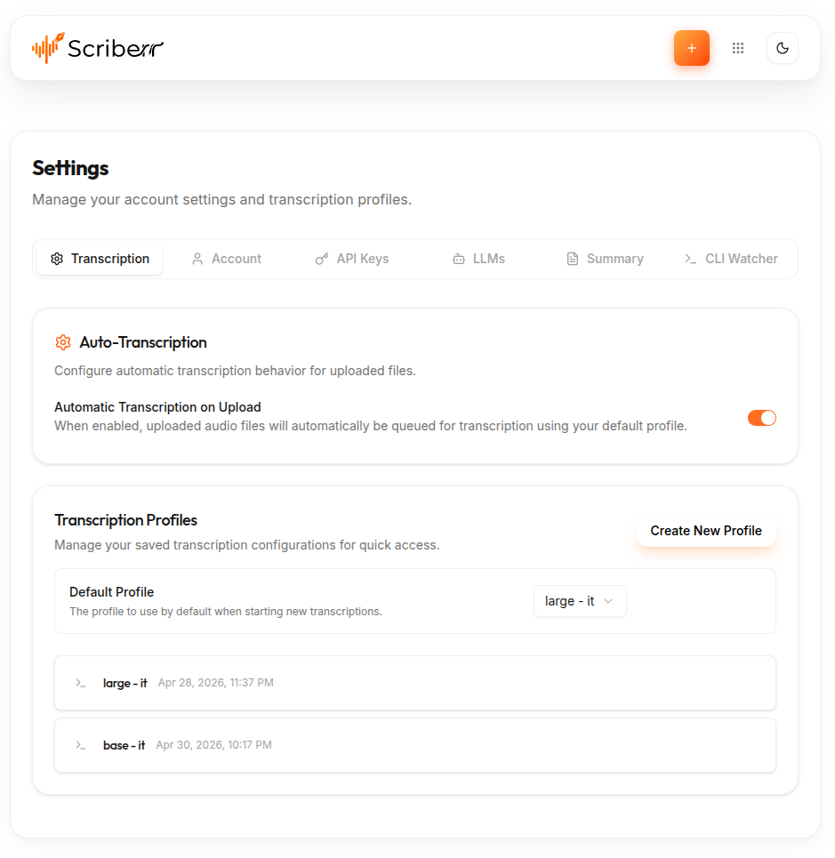

<h1 align="center">
  scriberrTG
  <br>
  
</h1>
<p align="center">
  <a href="#scriberrtg">Overview</a> •
  <a href="#environment-variables">Environment</a> •
  <a href="#installation">Installation</a> •
  <a href="#docker-compose-development">Docker</a> •
  <a href="#local-development">Local development</a> •
  <a href="#releasing">Releasing</a>
</p>

---

Telegram bot that accepts audio/voice/documents and sends them to [Scriberr](https://github.com/rishikanthc/scriberr) for transcription and sends the transcription back to the user.

### Environment variables

- **`TELEGRAM_BOT_TOKEN`**: Telegram bot token
- **`SCRIBERR_API_TOKEN`**: Scriberr API token (API key/bearer)
- **`SCRIBERR_HOST_URL`**: Scriberr host URL (example: `http://scriberr-api:8080`)
#### Optional:
- **`SSE_TIMEOUT_MS`** (optional): max wait for server-sent events (default `600000`)
- **`PROFILE_CACHE_TTL_MS`** (optional): cache transcription profiles for this duration (default `600000`)
- **`TELEGRAM_ALLOWED_USER_IDS`** (optional): comma-separated Telegram user IDs; if set, only those users can use the bot. If unset or empty, anyone can use it. Useful for a public bot token that should only serve you.

## Installation

You can either run the project locally if node is available or use the released image through docker compose.
For the latter, at each tagged release you can find a docker-compose.yml file you can copy and edit to your needs.<br/>
Of course, you also need to have a Scriberr instance running. See the [docker folder](https://github.com/giacomocerquone/scriberrTG/tree/main/docker) for examples to help set up both ScriberrTG and Scriberr.

Then it's just a matter of running:

```bash
docker compose up -f docker-compose.yml -d
```

## Scriberr Configuration

Don't forget to create a *base profile* in Scriberr and to set "Automatic Transcription on Upload" to true.

_This will be addressed in a future version of the bot where the job will be started by the bot itself._



### Docker Compose development

Make sure to edit the docker-compose.dev.yml file to use the correct Scriberr's network name and container name.
Example: `http://scriberr:8080` — run `docker network inspect scriberr_network` to see names.

```bash
# Option A: create a local .env (recommended)
cp .env.example .env
# then edit .env
docker compose up --build
```

### Local development

```bash
npm install
cp .env.example .env
# then edit .env
npm run dev
```

### Releasing

Run `npm run release` to bump the version, commit, tag, and `git push --follow-tags`.
Then run `npm run release:github` to create the GitHub release with auto-generated notes (requires the [GitHub CLI](https://cli.github.com/) and the new tag on GitHub).

### TODO

- [ ] provide a web interface to configure the bot (especially the profile to use which is now fetched and cached on startup with a pre-defined ttl which is a bit weird) and see the logs
- [ ] add a stats functionality (once a year) to show some useful info